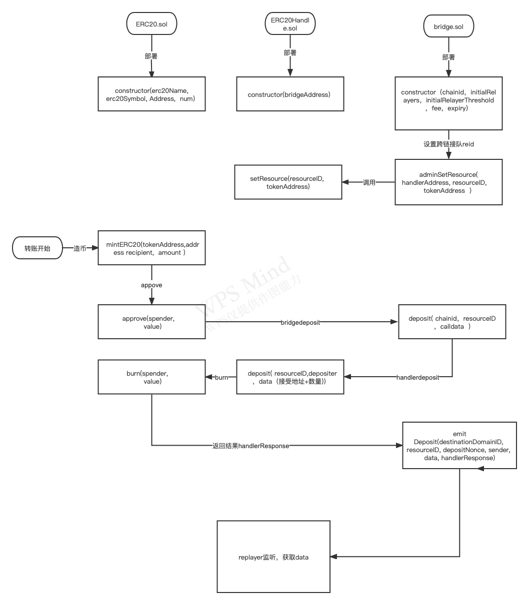
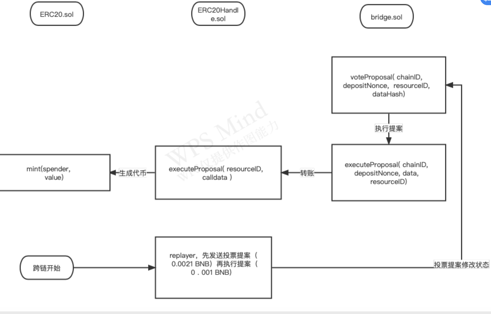

## 1. Overview

This guide describes the implementation of cross-chain transactions between polygon TEST (Mumbai Test Chain) and TIE Chain


## 2. Tool and Environmental Requirements

​ environment:

- Go: >= 1.16

- Node.js >= 16.13.0

- Git

  tool:

  - [ChainBridge](https://github.com/ChainSafe/ChainBridge): v1.1.5

  - [ChainBridge Deploy Tools](https://github.com/ChainSafe/chainbridge-deploy): `f2aa093` on `main` branch

    

## 3. Cross-chain contract deployment

### 3.1 Deployment script download:

```js

$ git clone https://github.com/ChainSafe/chainbridge-deploy.git
$ cd chainbridge-deploy/cb-sol-cli
$ make install

```


### 3.2 Deploy cross-chain contracts to polygon 

We will deploy the contract to the polygon TEST chain by command. This command deploys all contracts, including Bridge, ERC20 Handler, ERC721 Handler, Generic Handler, ERC20 and ERC721 contracts. Additionally, it sets default relay account addresses and thresholds.

Execution example:

```
$ cb-sol-cli deploy --all --chainId 99 
  --url https://rpc-mumbai.matic.today 
  --privateKey [ADMIN_ACCOUNT_PRIVATE_KEY] 
  --relayers [RELAYER_ACCOUNT_ADDRESS] 
  --relayerThreshold 1 
```

Execution example:

```
 cb-sol-cli deploy --all --chainId 97 
 --url  https://data-seed-prebsc-2-s1.binance.org:8545
 --privateKey 64a69c87b3d15dc1xxxxxxxxxxxxxxxxxxxxxx
 --relayers 0xAFC312512B8787848D75490377b093B1F7CF3033
 --relayerThreshold 1 
 --gasPrice 10000000000
 
Url:        https://data-seed-prebsc-2-s1.binance.org:8545
Deployer:   0xAFC312512B8787848D75490377b093B1F7CF3033
Gas Limit:   8000000
Gas Price:   10000000000
Deploy Cost: 0.14532642

Options
=======
Chain Id:    97
Threshold:   1
Relayers:    0xAFC312512B8787848D75490377b093B1F7CF3033
Bridge Fee:  0
Expiry:      100

Contract Addresses
================================================================
Bridge:             0xa5B27BdCb8af3d062e63C02b31Ee9E8763e9636B
----------------------------------------------------------------
Erc20 Handler:      0xE52482077205e0205a9B25b6f043B812A5c81f0e
----------------------------------------------------------------
Erc721 Handler:     0xFa4Ee64074b799a9Ee7951c0fDfb2F7b0dDcB6F6
----------------------------------------------------------------
Generic Handler:    0x48422E521f9063291c2f140a7Cec274C3c008Db4
----------------------------------------------------------------
Erc20:              0x52Ad3084a9Ad4152E52FdEAb8644a05E9Eb1E006
----------------------------------------------------------------
Erc721:             0xed94f9e20416531cBcb5A68F81D746D0F8Da6eec
----------------------------------------------------------------
Centrifuge Asset:   Not Deployed
----------------------------------------------------------------
WETC:               Not Deployed
================================================================
```


### 3.3 Deploy cross-chain contracts to TIE

Then deploy the contract to the TIE chain through the command, the steps are the same as above

Execution example:

```
$ cb-sol-cli deploy --all --chainId 100 
  --url http://localhost:10002 
  --privateKey [ADMIN_ACCOUNT_PRIVATE_KEY] 
  --relayers [RELAYER_ACCOUNT_ADDRESS] 
  --relayerThreshold 1
```


## 4. Relay configuration and start listening

###  4.1 Repeater download

```
$ git clone https://github.com/ChainSafe/ChainBridge.git
$ cd chainBridge && make install
```


### 4.2 Monitor configuration

Next, you need `config.json` to create and set the JSON-RPC URL, repeater address and contract address for each chain.

Execution example:

```

  "chains": [
    {
      "name": "polygon TEST",
      "type": "ethereum",
      "id": "97",
      "endpoint": "https://data-seed-prebsc-2-s1.binance.org:8545",
      "from": "<RELAYER_ACCOUNT_ADDRESS>",
      "opts": {
        "bridge": "<BRIDGE_CONTRACT_ADDRESS>",
        "erc20Handler": "<ERC20_HANDLER_CONTRACT_ADDRESS>",
        "erc721Handler": "<ERC721_HANDLER_CONTRACT_ADDRESS>",
        "genericHandler": "<GENERIC_HANDLER_CONTRACT_ADDRESS>",
        "minGasPrice": "1",
        "http": "true"
      }
    },
    {
      "name": "tie",
      "type": "ethereum",
      "id": "166",
      "endpoint": "http://localhost:10002",
      "from": "<RELAYER_ACCOUNT_ADDRESS>",
      "opts": {
        "bridge": "<BRIDGE_CONTRACT_ADDRESS>",
        "erc20Handler": "<ERC20_HANDLER_CONTRACT_ADDRESS>",
        "erc721Handler": "<ERC721_HANDLER_CONTRACT_ADDRESS>",
        "genericHandler": "<GENERIC_HANDLER_CONTRACT_ADDRESS>",
        "minGasPrice": "1",
        "http": "true"
      }
    }
  ]
}
```


### 4.3 import private key 

To start the relayer, you need to import the private key corresponding to the relayer account address. A password is required when importing the private key. After a successful import, the key will be stored in `keys/<ADDRESS>.key`.

Execution example:

```
$ chainbridge accounts import --privateKey [RELAYER_ACCOUNT_PRIVATE_KEY]

INFO[11-19|07:09:01] Importing key... 
Enter password to encrypt keystore file:
> [PASSWORD_TO_ENCRYPT_KEY]
INFO[11-19|07:09:05] private key imported    
```


### 4.4 start listener 

Once the listener starts, it will start watching each chain for new blocks.

Execution example:

```
chainbridge --config config.json --latest

INFO[11-19|07:15:19] Starting ChainBridge... 
Enter password for key ./keys/<RELAYER_ACCOUNT_ADDRESS>.key:
> [PASSWORD_TO_DECRYPT_KEY]
INFO[11-19|07:15:25] Connecting to ethereum chain...          chain=mumbai url=<JSON_RPC_URL>
Enter password for key ./keys/<RELAYER_ACCOUNT_ADDRESS>.key:
> [PASSWORD_TO_DECRYPT_KEY]
INFO[11-19|07:15:31] Connecting to ethereum chain...          chain=tie url=<JSON_RPC_URL>
```


Execution example:

```
cuiyang@bogon ChainBridge % ./build/chainbridge --config config.json --latest
INFO[04-08|10:51:26] Starting ChainBridge... 
Enter password for key ./keys/0xAFC312512B8787848D75490377b093B1F7CF3033.key:
> 
INFO[04-08|10:51:28] Connecting to ethereum chain...          chain=bsc url=https://data-seed-prebsc-2-s1.binance.org:8545
Enter password for key ./keys/0xAFC312512B8787848D75490377b093B1F7CF3033.key:
> 
INFO[04-08|10:51:33] Connecting to ethereum chain...          chain=tie url=http://192.168.1.132:8545
INFO[04-08|10:51:33] Started bsc chain                        system=core
INFO[04-08|10:51:33] Polling Blocks...                        chain=bsc block=18259742
INFO[04-08|10:51:33] Polling Blocks...                        chain=tie block=14947
INFO[04-08|10:51:33] Started ptie chain               system=core
INFO[04-08|13:19:22] Handling fungible deposit event          chain=tie dest=100 nonce=1
INFO[04-08|13:19:22] Attempting to resolve message            chain=tie type=FungibleTransfer src=100 dst=100 nonce=1 rId=000000000000000000000000000000c76ebe4a02bbc34786d860b355f5a5ce00
INFO[04-08|13:19:22] Creating erc20 proposal                  chain=tie src=100 nonce=1
INFO[04-08|13:19:22] Watching for finalization event          chain=tie src=100 nonce=1
INFO[04-08|13:19:22] Submitted proposal vote                  chain=tie tx=0x43bfdaa2a313ee6f420a5f91ca1d4b0030a6046aa0bc27729965e67036e5c62e src=100 depositNonce=1 gasPrice=1391
INFO[04-08|13:19:47] Submitted proposal execution             chain=tie tx=0xed53d30ca3d2240aa7ac95e2141791209621ff48fbf34ef992224743856a28e6 src=100 dst=100 nonce=1 gasPrice=1417
INFO[04-08|13:46:52] Handling fungible deposit event          chain=tie dest=97 nonce=1
INFO[04-08|13:46:52] Attempting to resolve message            chain=bsc type=FungibleTransfer src=100 dst=97 nonce=1 rId=000000000000000000000000000000c76ebe4a02bbc34786d860b355f5a5ce00
INFO[04-08|13:46:52] Creating erc20 proposal                  chain=bsc src=100 nonce=1
INFO[04-08|13:46:52] Watching for finalization event          chain=bsc src=100 nonce=1
INFO[04-08|13:46:52] Submitted proposal vote                  chain=bsc tx=0x205f61f6b1051ac84399acb211def61d2db76468a39139e8bb958bc4e2b72d3d src=100 depositNonce=1 gasPrice=10000000000
```

### 4.5 Overall contract and listener architecture diagram 


## 5. ERC20 Cross-chain transfer

### 5.1 Register resource ID

You will register a resource ID of an associated resource in a cross-chain environment. The resource ID is a 32-byte value that must be unique for the resource we transfer between these blockchains. Resource IDs are arbitrary, but they may have the chain ID of the main chain in the last byte, as a convention (the main chain refers to the network from which these resources originate).

Execution example:

```
$ cb-sol-cli bridge register-resource \
  --url https://rpc-mumbai.matic.today \
  --privateKey [ADMIN_ACCOUNT_PRIVATE_KEY] \
  # Set Resource ID for ERC20
  --resourceId "0x000000000000000000000000000000c76ebe4a02bbc34786d860b355f5a5ce00" \
  --bridge "[BRIDGE_CONTRACT_ADDRESS]" \
  --handler "[ERC20_HANDLER_CONTRACT_ADDRESS]" \
  --targetContract "[ERC20_CONTRACT_ADDRESS]"

# For tie chain
$ cb-sol-cli bridge register-resource \
  --url http://localhost:10002 \
  --privateKey [ADMIN_ACCOUNT_PRIVATE_KEY] \
  # Set Resource ID for ERC20
  --resourceId "0x000000000000000000000000000000c76ebe4a02bbc34786d860b355f5a5ce00" \
  --bridge "[BRIDGE_CONTRACT_ADDRESS]" \
  --handler "[ERC20_HANDLER_CONTRACT_ADDRESS]" \
  --targetContract "[ERC20_CONTRACT_ADDRESS]"
```

Execution example：

```
cb-sol-cli bridge register-resource   
--url  https://data-seed-prebsc-2-s1.binance.org:8545 --privateKey 64a69c87b3d15dc1XXXXXXXXXXXXXXXXXXXX
--resourceId "0x000000000000000000000000000000c76ebe4a02bbc34786d860b355f5a5ce00" 
--bridge  0xa5B27BdCb8af3d062e63C02b31Ee9E8763e9636B  
--handler  0xE52482077205e0205a9B25b6f043B812A5c81f0e 
--targetContract 0x52Ad3084a9Ad4152E52FdEAb8644a05E9Eb1E006 
--gasPrice 10000000000

[bridge/register-resource] Registering contract 0x52Ad3084a9Ad4152E52FdEAb8644a05E9Eb1E006 with resource ID 0x000000000000000000000000000000c76ebe4a02bbc34786d860b355f5a5ce00 on handler 0xE52482077205e0205a9B25b6f043B812A5c81f0e
Waiting for tx: 0xddb98e63e35b2b0da5abd8c1d9a0ca3b93cb0ec436402e859e2f072d559323a1...

```


### 5.2 Add token usage model (optional)

When transferring ERC20 tokens between chains, tokens can be handled in two different ways:
(1)  Lock/Release mode

**Source Chain**: The tokens you send will be locked in the ERC20 handler contract
In **Destination Chain**: The same amount of tokens that you sent in the source chain will be unlocked and transferred from the ERC20 handler contract to the receiving account in the target chain.

(2) Burn/Mint mode

**Source Chain**: Tokens you send will be burned
**Destination Chain**: The same amount of tokens that you send and burn on the source chain will be minted on the target chain and sent to the recipient account.

You can use different patterns in each chain. This means that you can lock an ERC20 token in the main chain while minting an ERC20 token in the child chain for transfer. For example, it might make sense to lock/release tokens if the total supply or minting schedule is controlled. Tokens will be minted/burned if the contracts in the subchain have to follow the supply in the main chain.

The default mode is **lock/release** mode. If you want to make the token mintable/burnable, you need to call the `adminSetBurnable` method. If you want to mint tokens on execution, you need to grant the `minter` role to the ERC20 handler contract

Execution example:

```
# Let ERC20 contract burn on source chain and mint on destination chain
$ cb-sol-cli bridge set-burn 
  --url http://localhost:10002 
  --privateKey [ADMIN_ACCOUNT_PRIVATE_KEY] 
  --bridge "[BRIDGE_CONTRACT_ADDRESS]" 
  --handler "[ERC20_HANDLER_CONTRACT_ADDRESS]" 
  --tokenContract "[ERC20_CONTRACT_ADDRESS]"

# Grant minter role to ERC20 Handler contract
$ cb-sol-cli erc20 add-minter 
  --url http://localhost:10002 
  --privateKey [ADMIN_ACCOUNT_PRIVATE_KEY] 
  --erc20Address "[ERC20_CONTRACT_ADDRESS]" 
  --minter "[ERC20_HANDLER_CONTRACT_ADDRESS]"
```

### 5.3 Cross-chain transfer

We will send ERC20 tokens from TIE chain to polygon chain.

First, you will get tokens by minting. Accounts with the miner role can mint new tokens. The account `minter` that has deployed ERC20 contracts has this role by default. To designate another account as a member of the `minter` role, you need to run the `cb-sol-cli erc20 add-minter` command

Execution example:

```
# Mint ERC20 tokens
$ cb-sol-cli erc20 mint 
  --url https://rpc-mumbai.matic.today 
  --privateKey [MINTER_ACCOUNT_PRIVATE_KEY] 
  --erc20Address "[ERC20_CONTRACT_ADDRESS]" 
  --amount 1000
  
  # Approve transfer from the account by ERC20 Handler
  # Next, you need to approve the transfer of ERC20 tokens from the account via the ERC20 Handler
$ cb-sol-cli erc20 approve 
  --url https://rpc-mumbai.matic.today 
  --privateKey [USER_ACCOUNT_ADDRESS] 
  --erc20Address "[ERC20_CONTRACT_ADDRESS]" 
  --recipient "[ERC20_HANDLER_CONTRACT_ADDRESS]" 
  --amount 500
  
  
  # Start transfer from tie  to polygon chain
  # To transfer tokens to the polygon chain, you will call deposit
$ cb-sol-cli erc20 deposit \
  --url https://rpc-mumbai.matic.today \
  --privateKey [PRIVATE_KEY] \
  --amount 10 \
  # ChainID of tie chain
  --dest 100 \
  --bridge "[BRIDGE_CONTRACT_ADDRESS]" \
  --recipient "[RECIPIENT_ADDRESS_IN_TIE_CHAIN]" \
  --resourceId "0x000000000000000000000000000000c76ebe4a02bbc34786d860b355f5a5ce00"
```


Execution example：

```
cb-sol-cli erc20 mint 
--url http://192.168.1.132:8545 
--privateKey 64a69c87b3d15dc1f03XXXXXXXXXXXXXXXXXXXXXXXX 
--erc20Address 0x10D95320F84e96eDd3C69347Ebcf83a6B7fae0cb 
--amount 1000

[erc20/mint] Minting 1000 tokens to 0xAFC312512B8787848D75490377b093B1F7CF3033 on contract 0x10D95320F84e96eDd3C69347Ebcf83a6B7fae0cb
Waiting for tx: 0x676ca8505f93a7266e266212783cd643161101f682f939ef43d3a4dc21e7bf3b...


cb-sol-cli erc20 approve  
--url http://192.168.1.132:8545  
--privateKey 64a69c87b3d15dc1XXXXXXXXXXXXXXXXXXXXXXXX
--erc20Address 0x10D95320F84e96eDd3C69347Ebcf83a6B7fae0cb
--recipient 0x18ace2Bc228ffF3459e06646a10bb40c3420E07A 
--amount 500

[erc20/approve] Approving 0x18ace2Bc228ffF3459e06646a10bb40c3420E07A to spend 500 tokens from 0xAFC312512B8787848D75490377b093B1F7CF3033!
Waiting for tx: 0xe78841a61ceca9714ef830e2e4f05296b92370884045155e2b3e21f7ef556be3...


cb-sol-cli erc20 deposit 
--url  http://192.168.1.132:8545 
--privateKey 64a69c87b3d15dc1fXXXXXXXXXXXXXXXXXXXXXXX
--amount 10  
--dest 97
--bridge 0x75332FD24A14EB201f7c635f885b30D3F8B118F8 
--recipient 0xAFC312512B8787848D75490377b093B1F7CF3033  
--resourceId "0x000000000000000000000000000000c76ebe4a02bbc34786d860b355f5a5ce00"


[erc20/deposit] Constructed deposit:
[erc20/deposit]   Resource Id: 0x000000000000000000000000000000c76ebe4a02bbc34786d860b355f5a5ce00
[erc20/deposit]   Amount: 0x8ac7230489e80000
[erc20/deposit]   len(recipient): 20
[erc20/deposit]   Recipient: 0xAFC312512B8787848D75490377b093B1F7CF3033
[erc20/deposit]   Raw: 0x0000000000000000000000000000000000000000000000008ac7230489e800000000000000000000000000000000000000000000000000000000000000000014AFC312512B8787848D75490377b093B1F7CF3033
[erc20/deposit] Creating deposit to initiate transfer!
Waiting for tx: 0x418bfc456dc14161425ec30cb37b56575a254191dd88f4a61bcacdc149a6681c...
```


### 5.3 The repeater listens for transactions and sends them

After the deposit transaction is successful, the relayer will get the event and vote on the proposal. After submitting the required number of votes, it executes a transaction to send tokens to recipient accounts in the TIE chain.

```
INFO[11-19|08:15:58] Handling fungible deposit event          chain=mumbai dest=100 nonce=1
INFO[11-19|08:15:59] Attempting to resolve message            chain=tie type=FungibleTransfer src=99 dst=100 nonce=1 rId=000000000000000000000000000000c76ebe4a02bbc34786d860b355f5a5ce00
INFO[11-19|08:15:59] Creating erc20 proposal                  chain=tie src=99 nonce=1
INFO[11-19|08:15:59] Watching for finalization event          chain=tie src=99 nonce=1
INFO[11-19|08:15:59] Submitted proposal vote                  chain=tie tx=0x67a97849951cdf0480e24a95f59adc65ae75da23d00b4ab22e917a2ad2fa940d src=99 depositNonce=1 gasPrice=1
INFO[11-19|08:16:24] Submitted proposal execution             chain=tie tx=0x63615a775a55fcb00676a40e3c9025eeefec94d0c32ee14548891b71f8d1aad1 src=99 dst=100 nonce=1 gasPrice=5

```


### 5.4 View cross-chain transaction results

Once the transaction is executed successfully, you will get tokens in the polygon chain.

Execution example:

```
$ cb-sol-cli erc20 balance 
  --url https://localhost:10002 
  --privateKey [PRIVATE_KEY] 
  --erc20Address "[ERC20_CONTRACT_ADDRESS]" 
  --address "[ACCOUNT_ADDRESS]"

```

Execution example：

TIE sends cross-chain transactions reduced by 10, polygon TEST chain receives 10

```
cb-sol-cli erc20 balance 
--url http://192.168.1.132:8545 
--privateKey 64a69c87b3d15dc1f03715493XXXXXXXXXXXXXXXXXX 
--erc20Address 0x10D95320F84e96eDd3C69347Ebcf83a6B7fae0cb  
--address 0xAFC312512B8787848D75490377b093B1F7CF3033
[erc20/balance] Account 0xAFC312512B8787848D75490377b093B1F7CF3033 has a balance of 990.0

cb-sol-cli erc20 balance 
--url https://data-seed-prebsc-2-s1.binance.org:8545 
--privateKey 64a69c87b3d15dc1f03715493XXXXXXXXXXXXXXXXXX 
--erc20Address 0x52Ad3084a9Ad4152E52FdEAb8644a05E9Eb1E006 
--address 0xAFC312512B8787848D75490377b093B1F7CF3033
[erc20/balance] Account 0xAFC312512B8787848D75490377b093B1F7CF3033 has a balance of 10.0


```


### 5.5 Cross-chain transfer and accept contract function call graph



The function process of the A chain sending the cross-chain contract to the listener

 

The function call process sent by the listener to the B chain															

## 6. ERC721 Cross-chain transfer

### 6.1 Generate erc721 non-fungible tokens

First generate a non-fungible token through the erc721 contract, and now there is a token with an id of 0x50 that belongs to you.

```
 cb-sol-cli erc721 mint 
 --url https://data-seed-prebsc-2-s1.binance.org:8545 
 --privateKey 64a69c87b3d15dc1f03715493b7XXXXXXXXXXXXXXXX
 --erc721Address 0xed94f9e20416531cBcb5A68F81D746D0F8Da6eec --id 0x50 
 --gasPrice 10000000000
WARNING: Multiple definitions for safeTransferFrom
[erc721/mint] Minting token with id 0x50 to 0xAFC312512B8787848D75490377b093B1F7CF3033 on contract 0xed94f9e20416531cBcb5A68F81D746D0F8Da6eec!


cb-sol-cli erc721 owner 
--url  https://data-seed-prebsc-2-s1.binance.org:8545 
--privateKey 64a69c87b3d15dc1f0371549XXXXXXXXXXXXXXXX
--erc721Address 0xed94f9e20416531cBcb5A68F81D746D0F8Da6eec 
--id 0x50 
--gasPrice 10000000000


[erc721/owner] Owner of token 0x50 is 0xAFC312512B8787848D75490377b093B1F7CF3033
```


### 6.2 Non-fungible tokens can be called and transferred by contracts

First of all, we have to agree that the contract can call our token (because it is a non-fungible token, the approve must be accurate to the id)

```
cb-sol-cli erc721 approve
--url https://data-seed-prebsc-2-s1.binance.org:8545
--privateKey 64a69c87b3d15dc1f037XXXXXXXXXXXXXXXXXXXXX 
--erc721Address 0xed94f9e20416531cBcb5A68F81D746D0F8Da6eec 
--recipient 0xFa4Ee64074b799a9Ee7951c0fDfb2F7b0dDcB6F6 
--id 0x50 --gasPrice 10000000000


[erc721/approve] Approving 0xFa4Ee64074b799a9Ee7951c0fDfb2F7b0dDcB6F6 to spend token 0x50 from 0xAFC312512B8787848D75490377b093B1F7CF3033 on contract 0xed94f9e20416531cBcb5A68F81D746D0F8Da6eec!
```


### 6.3 Cross-chain transfer of non-fungible tokens

```
cb-sol-cli erc721 deposit 
--url https://data-seed-prebsc-2-s1.binance.org:8545
--privateKey 64a69c87b3d15dc1f0XXXXXXXXXXXXXXXXXXXXXXXXXXXX 
--bridge 0x92cf2A9a8e7F8a2FF2889D33D98992ef3bc1226f
--resourceId "0x000000000000000000000000000000e389d61c11e5fe32ec1735b3cd38c69501" 
--id 0x50 
--dest 200 
--recipient 0xAFC312512B8787848D75490377b093B1F7CF3033 
--gasPrice 10000000000 

[erc721/deposit] Constructed deposit:
[erc721/deposit]   Resource Id: 0x000000000000000000000000000000e389d61c11e5fe32ec1735b3cd38c69501
[erc721/deposit]   Token Id: 0x50
[erc721/deposit]   len(recipient): 20
[erc721/deposit]   Recipient: 0xAFC312512B8787848D75490377b093B1F7CF3033
[erc721/deposit]   Raw: 0x00000000000000000000000000000000000000000000000000000000000000500000000000000000000000000000000000000000000000000000000000000014AFC312512B8787848D75490377b093B1F7CF3033

```


### 6.4 View non-fungible token cross-chain transfer results

The non-fungible token with the id of ox51 has been received on the local test chain

```
cb-sol-cli erc721 owner 

--url  http://119.28.23.120:8545 
--privateKey 64a69c87b3d15dc1f03715493XXXXXXXXXXXXXXXXXXXXXXX
--erc721Address 0x6c55cBf613d47f57Aef71605B005Bf098680cf02  
--id 0x50


[erc721/owner] Owner of token 0x50 is 0xAFC312512B8787848D75490377b093B1F7CF3033
```


## 7. Native cross-chain transfer (non-burning)

### 7.1 Conduct wtie (erc20) cross-chain transfers

First, send 1 coin to the local chain and cross-chain

```
cb-sol-cli erc20 deposit 
--url https://data-seed-prebsc-2-s1.binance.org:8545  
--privateKey 64a69c87b3d15dc1f037154XXXXXXXXXXXXXXXXXXXX  
--amount 1  
--dest 200   
--bridge  0xa5B27BdCb8af3d062e63C02b31Ee9E8763e9636B  
--recipient 0xAFC312512B8787848D75490377b093B1F7CF3033  
--resourceId "0x000000000000000000000000000000c76ebe4a02bbc34786d860b355f5a5ce02" 
--gasPrice 10000000000

[erc20/deposit] Constructed deposit:
[erc20/deposit]   Resource Id: 0x000000000000000000000000000000c76ebe4a02bbc34786d860b355f5a5ce02
[erc20/deposit]   Amount: 0x0de0b6b3a7640000
[erc20/deposit]   len(recipient): 20
[erc20/deposit]   Recipient: 0xAFC312512B8787848D75490377b093B1F7CF3033
[erc20/deposit]   Raw: 0x0000000000000000000000000000000000000000000000000de0b6b3a76400000000000000000000000000000000000000000000000000000000000000000014AFC312512B8787848D75490377b093B1F7CF3033
[erc20/deposit] Creating deposit to initiate transfer!
```


### 7.2 Check whether to save to the contract pool

Check that the tokens have been saved in the pool of the ERC20Hander contract

```
cb-sol-cli erc20 balance 
--url  https://data-seed-prebsc-2-s1.binance.org:8545 
--privateKey 64a69c87b3d15dc1f03715XXXXXXXXXXXXXXXXXXXXXXXXXX
--erc20Address  0x10D95320F84e96eDd3C69347Ebcf83a6B7fae0cb  
--address 0xE52482077205e0205a9B25b6f043B812A5c81f0e 
--gasPrice 10000000000    
[erc20/balance] Account 0xE52482077205e0205a9B25b6f043B812A5c81f0e has a balance of 1.0
```


### 7.3 View the result of wtie spanning to the local chain

The local chain has received 1 weth

```
cb-sol-cli erc20 balance 
--url  http://119.28.23.120:8545
--privateKey 64a69c87b3d15dc1f0371549XXXXXXXXXXXXXXXXXXXXXX 
--erc20Address  0x10D95320F84e96eDd3C69347Ebcf83a6B7fae0cb 
--address 0xAFC312512B8787848D75490377b093B1F7CF3033 

[erc20/balance] Account 0xAFC312512B8787848D75490377b093B1F7CF3033 has a balance of 1.0
```

### 7.4 Convert wtie to native tie

The call conversion contract is converted from wtie to tie.