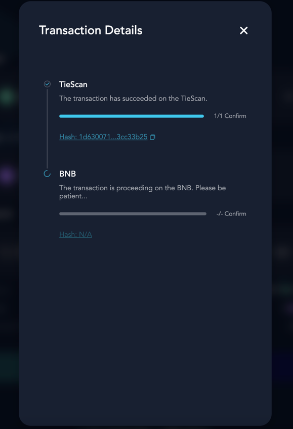

## 1. front page

## 2. Basic function description
| Field Name | Function Description |
|-----------------|:------------:|
| Asset | Select Token |
| From | Cross-chain start chain |
| To | Cross-chain target chain |
| Amount | Cross-chain Amount |
| Connect Wallet | Connect Wallet |

## 3. Steps

- First, connect the wallet of the origination chain, for example: Metamask

- Then, connect the wallet of the target chain, eg: Binance

- Fill in the cross-chain amount and authorize the wallet (approve)

- Wallet allows authorization

- Perform cross-chain transfer and wallet confirmation

- After the wallet is confirmed, enter the waiting state, which takes about 2-3 minutes (the window can be closed)

- View transaction history
The status of the transaction history list, you can re-check the execution status.

- Main currency to ERC20 Recharge button,
Spend the main currency, recharge ERC20 tokens, only the asset TIE and the starting chain is Tie,
This recharge function is available.

Description: When the TIE cross-chain amount is equal to all amounts (that is, all conversions),
There is a risk of loss, because the contract needs to deduct the handling fee.

## 4. appendix

Contract address information of currently supported chains

| Token | Chain |                Contract Hash                 |
|-------|------:|:--------------------------------------------:|
| USDT  |   TIE |  0xB5fabF404a12687ACe6d6f524825AC2df4B49e9E  |
| USDT  |   BSC |  0x52Ad3084a9Ad4152E52FdEAb8644a05E9Eb1E006  |
| TIE   |   TIE |  0x1418eD3036667d977394Ed86236DeA7499DB36e6  |
| TIE   |   BSC |  0x10D95320F84e96eDd3C69347Ebcf83a6B7fae0cb  |
| BNB   |   TIE |  0x2E567771D1eAb85d2a77cB832aD530e8c2C38A71  |
| BNB   |   BSC |  0xC7559ba3717BC743444E4B7d00C13160F07651a8  |