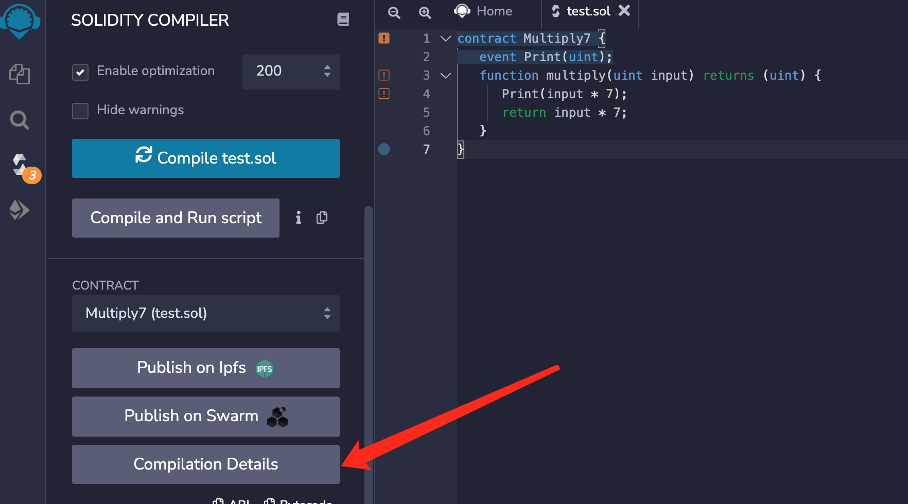
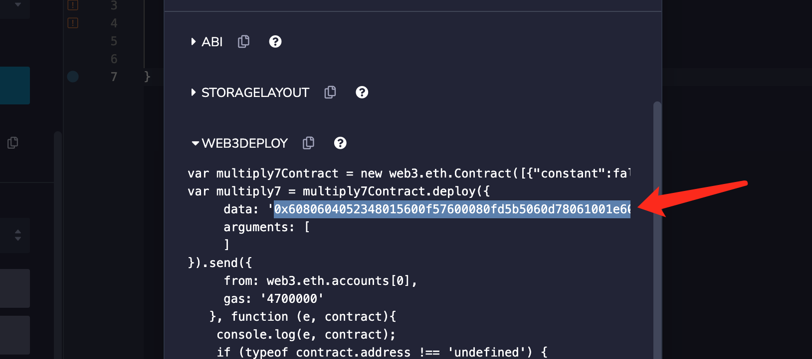
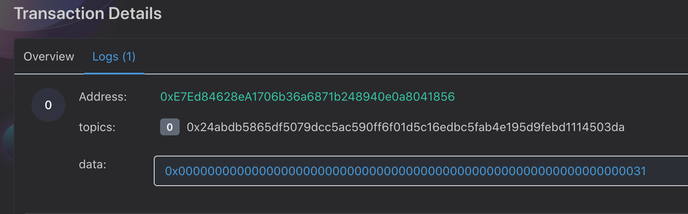

## 1. write contract
- Write a simple smart contract first

   ```go
   contract Multiply7 {
      event Print(uint);
      function multiply(uint input) returns (uint) {
         Print(input * 7);
         return input * 7;
      }
   }
   ```

## 2. Compile with remix
- This is a contract to input an unsigned integer for multiplication, and then use remix ide to compile; **After the compilation is passed, click "Details" and copy the "data" data in "WEB3DEPLOY"

   

   

   ```go
   // The source address from which the transaction was sent
   from := response.HexToAddress("0xf1c85E122Ca79F70dD7615b9038e06F4f5913611")
   input, _ := hex.ParseHexBytes("0x608060405234801561001057600080fd5b5060f58061001f6000396000f300608060405260043610603f576000357c0100000000000000000000000000000000000000000000000000000000900463ffffffff168063c6888fa1146044575b600080fd5b348015604f57600080fd5b50606c600480360381019080803590602001909291905050506082565b6040518082815260200191505060405180910390f35b60007f24abdb5865df5079dcc5ac590ff6f01d5c16edbc5fab4e195d9febd1114503da600783026040518082815260200191505060405180910390a16007820290509190505600a165627a7a72305820d36dc369a6f3f653b02c492e077b9cfdb114054f44f46277eaa4826e968609010029")
   // Construct the transaction object, set gas, gasprice, value. In wei.
   // Check the source code to see the property type of response.Transaction
   txn := &response.Transaction{
           From:     from,
           Gas:      250000,
           GasPrice: 10000000000,
           Input:    input,
   }
   hexprv := "ff889c4228f47bcdbf17eca88868ec5f235dc082afa34b2a8a4e46252fee60ff" // Example fake private key
   //nonce, _ := tie.Eth().GetNonce(txn.From, response.Latest)
   //txn.Nonce = nonce
   sign, err := tie.Eth().Sign(hexprv, txn, rpc.ChainID)
   if err != nil {
           fmt.Println(err.Error())
   }
   // Send the transaction. err needs to be checked, and the transaction hash address will be returned if the sending is successful. Use the address to find the transaction in the blockchain browser
   result, err := tie.Eth().SendRawTransactionStr(sign)
   if err != nil {
           fmt.Println(err.Error())
   }
   
   fmt.Println(result)
   ```

## 3. deploy contract
- The Sign() and SendRawTransaction() methods are used to deploy the contract, where from corresponds to the account address of the deployed contract, and gas corresponds to the gas consumption, if too little, an error will be reported. Input corresponds to the previously copied data

## 4. Excuting an order
- The transaction hash is returned after executing the command

   ```shell
   0x9fbd58bc0163867f572d3f87abe0d10c3b9a1b6cd518f8a7085de2d9386b7934
   ```
## 5. Query the details of the deployed contract
- Through this transaction hash, we can query the details of the deployed contract. We can use the GetTransactionReceipt() method to verify it (you can also use the blockchain browser to verify whether the transaction hash exists)

   ```go
   buf := response.HexToHash("0x9fbd58bc0163867f572d3f87abe0d10c3b9a1b6cd518f8a7085de2d9386b7934")
   receipt, _ := tie.Eth().GetTransactionReceipt(buf)
   fmt.Println(receipt.ContractAddress)
   //Get the address of the contract: 0xE7Ed84628eA1706b36a6871b248940e0a8041856
   ```

## 6. call contract
- After getting the contract address, we can call the contract through the Sign() and SendRawTransaction() methods

   ```go
   // call contract method
   fun := "multiply(uint256)"
   bs := []byte(fun)
   b := response.Keccak256(bs)
   res := rpc.EncodeToHex(b)
   r := rpc.SubStr(res, 10)

   // Call contract method parameters
   hash := response.HexToHash("7")
   s2 := hash.String()
   s3 := s2[2:]

   // concatenate input parameters
   var build strings.Builder
   build.WriteString(r)
   build.WriteString(s3)
   s4 := build.String()
   fmt.Println(s4)
   tie, err := rpc.NewClient(rpc.Url)
   if err != nil {
       fmt.Println(err.Error())
   }

   // The source address from which the transaction was sent
   from := response.HexToAddress("0xf1c85E122Ca79F70dD7615b9038e06F4f5913611")
   to := response.HexToAddress("0xE7Ed84628eA1706b36a6871b248940e0a8041856")
   input, _ := rpc.ParseHexBytes(s4)
   
   // Construct the transaction object, set gas, gasprice, value. In wei.
   // Check the source code to see the property type of response.Transaction
   txn := &response.Transaction{
           From:     from,
           To:       &to,
           Gas:      250000,
           GasPrice: 10000000000,
           Input:    input,
   }
   hexprv := "ff889c4228f47bcdbf17eca88868ec5f235dc082afa34b2a8a4e46252fee60ff" // Example fake private key
   sign, err := tie.Eth().Sign(hexprv, txn, rpc.ChainID)
   if err != nil {
           fmt.Println(err.Error())
   }

   // Send transaction. err needs to be checked, and the transaction hash address will be returned if the sending is successful. Use the address to find the transaction in the blockchain browser
   result, err := tie.Eth().SendRawTransactionStr(sign)
   if err != nil {
           fmt.Println(err.Error())
   }
   fmt.Println(result)
   // Obtained transaction hash: 0x742e610c5f393216c7d0c52b3d3c871343818f21e04f80ec19aa40deb6c88838
   ```

## 7. Query in the blockchain browser
- Through this transaction hash, the details of the calling contract can be queried in the browser

   

   Let's take a look at the logs in the returned data, which may contain the result of calling the contract. It can be seen that the data value in the log is also 0x00000000000000000000000000000000000000000000000000000000000000000000031, convert this hexadecimal to decimal to get the number 49. 49 is exactly the result of 7*7, which means that we successfully called the multiply method of the contract and got the correct result