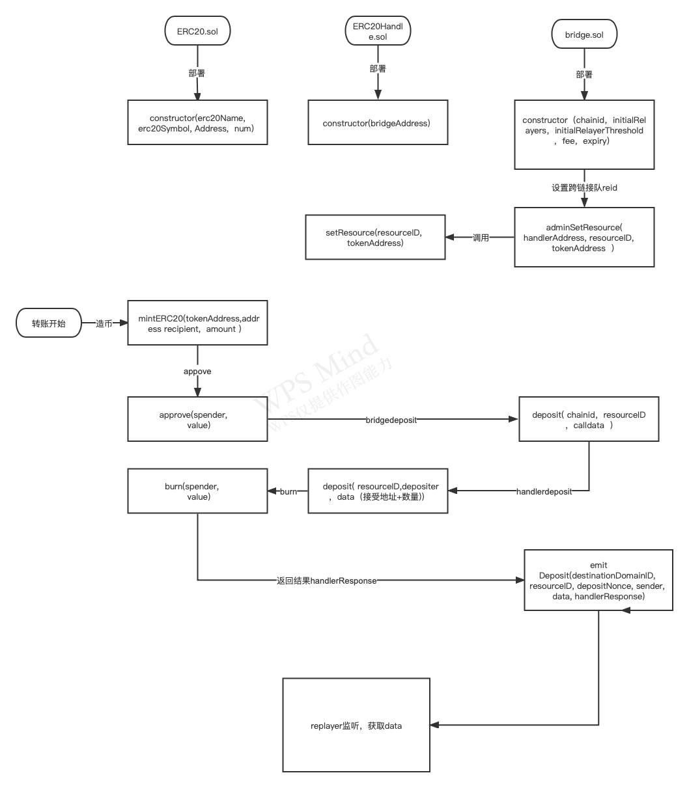

## 1. 概述
本指南介绍polygon TEST（孟买测试链）和 TIE链之间的跨链交易实施


## 2. 工具和环境要求

​      环境：

- Go: >= 1.16

- Node.js >= 16.13.0

- Git

  工具：

  - [ChainBridge](https://github.com/ChainSafe/ChainBridge): v1.1.5

  - [ChainBridge Deploy Tools](https://github.com/ChainSafe/chainbridge-deploy): `f2aa093` on `main` branch

    

## 3. 跨链合约部署

### 3.1 部署脚本下载：

```js

$ git clone https://github.com/ChainSafe/chainbridge-deploy.git
$ cd chainbridge-deploy/cb-sol-cli
$ make install

```


### 3.2 部署跨链合约到polygon 

我们将通过命令将合约部署到 polygon TEST 链。该命令部署所有合约，包括 Bridge、ERC20 Handler、ERC721 Handler、Generic Handler、ERC20 和 ERC721 合约。此外，它还会设置默认的中继帐户地址和阈值。

执行示范：

```
$ cb-sol-cli deploy --all --chainId 99 
  --url https://rpc-mumbai.matic.today 
  --privateKey [ADMIN_ACCOUNT_PRIVATE_KEY] 
  --relayers [RELAYER_ACCOUNT_ADDRESS] 
  --relayerThreshold 1 
```


执行实例：

```
 cb-sol-cli deploy --all --chainId 97 
 --url  https://rpc-mumbai.matic.today 
 --privateKey 64a69c87b3d15dc1xxxxxxxxxxxxxxxxxxxxxx
 --relayers 0xAFC312512B8787848D75490377b093B1F7CF3033
 --relayerThreshold 1 
 --gasPrice 10000000000
 
Url:        https://rpc-mumbai.matic.today 
Deployer:   0xAFC312512B8787848D75490377b093B1F7CF3033
Gas Limit:   8000000
Gas Price:   10000000000
Deploy Cost: 0.14532642

Options
=======
Chain Id:    97
Threshold:   1
Relayers:    0xAFC312512B8787848D75490377b093B1F7CF3033
Bridge Fee:  0
Expiry:      100

Contract Addresses
================================================================
Bridge:             0xa5B27BdCb8af3d062e63C02b31Ee9E8763e9636B
----------------------------------------------------------------
Erc20 Handler:      0xE52482077205e0205a9B25b6f043B812A5c81f0e
----------------------------------------------------------------
Erc721 Handler:     0xFa4Ee64074b799a9Ee7951c0fDfb2F7b0dDcB6F6
----------------------------------------------------------------
Generic Handler:    0x48422E521f9063291c2f140a7Cec274C3c008Db4
----------------------------------------------------------------
Erc20:              0x52Ad3084a9Ad4152E52FdEAb8644a05E9Eb1E006
----------------------------------------------------------------
Erc721:             0xed94f9e20416531cBcb5A68F81D746D0F8Da6eec
----------------------------------------------------------------
Centrifuge Asset:   Not Deployed
----------------------------------------------------------------
WETC:               Not Deployed
================================================================
```


### 3.3 部署跨链合约到TIE

再将通过命令将合约部署到 TIE 链 ，步骤同上

执行示范：

```
$ cb-sol-cli deploy --all --chainId 100 
  --url http://localhost:10002 
  --privateKey [ADMIN_ACCOUNT_PRIVATE_KEY] 
  --relayers [RELAYER_ACCOUNT_ADDRESS] 
  --relayerThreshold 1
```


## 4. 中继配置和启动监听

###  4.1 中继器下载

```
$ git clone https://github.com/ChainSafe/ChainBridge.git
$ cd chainBridge && make install
```


### 4.2 监听配置

接下来，您需要`config.json`为每条链创建和设置 JSON-RPC URL、中继器地址和合约地址。

执行示范：

```

  "chains": [
    {
      "name": "polygon test",
      "type": "ethereum",
      "id": "99",
      "endpoint": "https://rpc-mumbai.matic.today ",
      "from": "<RELAYER_ACCOUNT_ADDRESS>",
      "opts": {
        "bridge": "<BRIDGE_CONTRACT_ADDRESS>",
        "erc20Handler": "<ERC20_HANDLER_CONTRACT_ADDRESS>",
        "erc721Handler": "<ERC721_HANDLER_CONTRACT_ADDRESS>",
        "genericHandler": "<GENERIC_HANDLER_CONTRACT_ADDRESS>",
        "minGasPrice": "1",
        "http": "true"
      }
    },
    {
      "name": "tie",
      "type": "ethereum",
      "id": "166",
      "endpoint": "http://localhost:10002",
      "from": "<RELAYER_ACCOUNT_ADDRESS>",
      "opts": {
        "bridge": "<BRIDGE_CONTRACT_ADDRESS>",
        "erc20Handler": "<ERC20_HANDLER_CONTRACT_ADDRESS>",
        "erc721Handler": "<ERC721_HANDLER_CONTRACT_ADDRESS>",
        "genericHandler": "<GENERIC_HANDLER_CONTRACT_ADDRESS>",
        "minGasPrice": "1",
        "http": "true"
      }
    }
  ]
}
```


### 4.3 倒入私钥 

启动relayer需要导入relayer账户地址对应的私钥。导入私钥时需要输入密码。导入成功后，密钥将存储在`keys/<ADDRESS>.key`.

执行示范：

```
$ chainbridge accounts import --privateKey [RELAYER_ACCOUNT_PRIVATE_KEY]

INFO[11-19|07:09:01] Importing key... 
Enter password to encrypt keystore file:
> [PASSWORD_TO_ENCRYPT_KEY]
INFO[11-19|07:09:05] private key imported    
```


### 4.4 启动监听者 

一旦监听者开始，它将开始观察每条链中的新块。

执行示范：

```
chainbridge --config config.json --latest

INFO[11-19|07:15:19] Starting ChainBridge... 
Enter password for key ./keys/<RELAYER_ACCOUNT_ADDRESS>.key:
> [PASSWORD_TO_DECRYPT_KEY]
INFO[11-19|07:15:25] Connecting to ethereum chain...          chain=mumbai url=<JSON_RPC_URL>
Enter password for key ./keys/<RELAYER_ACCOUNT_ADDRESS>.key:
> [PASSWORD_TO_DECRYPT_KEY]
INFO[11-19|07:15:31] Connecting to ethereum chain...          chain=tie url=<JSON_RPC_URL>
```


执行实例：

```
cuiyang@bogon ChainBridge % ./build/chainbridge --config config.json --latest
INFO[04-08|10:51:26] Starting ChainBridge... 
Enter password for key ./keys/0xAFC312512B8787848D75490377b093B1F7CF3033.key:
> 
INFO[04-08|10:51:28] Connecting to ethereum chain...          chain=polygon url=https://rpc-mumbai.matic.today 
Enter password for key ./keys/0xAFC312512B8787848D75490377b093B1F7CF3033.key:
> 
INFO[04-08|10:51:33] Connecting to ethereum chain...          chain=tie url=http://192.168.1.132:8545
INFO[04-08|10:51:33] Started polygon chain                        system=core
INFO[04-08|10:51:33] Polling Blocks...                        chain=polygon block=18259742
INFO[04-08|10:51:33] Polling Blocks...                        chain=tie block=14947
INFO[04-08|10:51:33] Started ptie chain               system=core
INFO[04-08|13:19:22] Handling fungible deposit event          chain=tie dest=100 nonce=1
INFO[04-08|13:19:22] Attempting to resolve message            chain=tie type=FungibleTransfer src=100 dst=100 nonce=1 rId=000000000000000000000000000000c76ebe4a02bbc34786d860b355f5a5ce00
INFO[04-08|13:19:22] Creating erc20 proposal                  chain=tie src=100 nonce=1
INFO[04-08|13:19:22] Watching for finalization event          chain=tie src=100 nonce=1
INFO[04-08|13:19:22] Submitted proposal vote                  chain=tie tx=0x43bfdaa2a313ee6f420a5f91ca1d4b0030a6046aa0bc27729965e67036e5c62e src=100 depositNonce=1 gasPrice=1391
INFO[04-08|13:19:47] Submitted proposal execution             chain=tie tx=0xed53d30ca3d2240aa7ac95e2141791209621ff48fbf34ef992224743856a28e6 src=100 dst=100 nonce=1 gasPrice=1417
INFO[04-08|13:46:52] Handling fungible deposit event          chain=tie dest=97 nonce=1
INFO[04-08|13:46:52] Attempting to resolve message            chain=polygon type=FungibleTransfer src=100 dst=97 nonce=1 rId=000000000000000000000000000000c76ebe4a02bbc34786d860b355f5a5ce00
INFO[04-08|13:46:52] Creating erc20 proposal                  chain=polygon src=100 nonce=1
INFO[04-08|13:46:52] Watching for finalization event          chain=polygon src=100 nonce=1
INFO[04-08|13:46:52] Submitted proposal vote                  chain=polygon tx=0x205f61f6b1051ac84399acb211def61d2db76468a39139e8bb958bc4e2b72d3d src=100 depositNonce=1 gasPrice=10000000000
```

### 4.5 整体合约和监听者架构图 


## 5. ERC20 跨链转账

### 5.1 注册资源ID

您将在跨链环境中注册一个关联资源的资源 ID。资源 ID 是一个 32 字节的值，对于我们在这些区块链之间传输的资源必须是唯一的。资源 ID 是任意的，但它们可能在最后一个字节中具有主链的链 ID，作为约定（主链指的是这些资源源自的网络）。

执行示范：

```
$ cb-sol-cli bridge register-resource \
  --url https://rpc-mumbai.matic.today \
  --privateKey [ADMIN_ACCOUNT_PRIVATE_KEY] \
  # Set Resource ID for ERC20
  --resourceId "0x000000000000000000000000000000c76ebe4a02bbc34786d860b355f5a5ce00" \
  --bridge "[BRIDGE_CONTRACT_ADDRESS]" \
  --handler "[ERC20_HANDLER_CONTRACT_ADDRESS]" \
  --targetContract "[ERC20_CONTRACT_ADDRESS]"

# For tie chain
$ cb-sol-cli bridge register-resource \
  --url http://localhost:10002 \
  --privateKey [ADMIN_ACCOUNT_PRIVATE_KEY] \
  # Set Resource ID for ERC20
  --resourceId "0x000000000000000000000000000000c76ebe4a02bbc34786d860b355f5a5ce00" \
  --bridge "[BRIDGE_CONTRACT_ADDRESS]" \
  --handler "[ERC20_HANDLER_CONTRACT_ADDRESS]" \
  --targetContract "[ERC20_CONTRACT_ADDRESS]"
```

执行实例：

```
cb-sol-cli bridge register-resource   
--url  https://rpc-mumbai.matic.today  --privateKey 64a69c87b3d15dc1XXXXXXXXXXXXXXXXXXXX
--resourceId "0x000000000000000000000000000000c76ebe4a02bbc34786d860b355f5a5ce00" 
--bridge  0xa5B27BdCb8af3d062e63C02b31Ee9E8763e9636B  
--handler  0xE52482077205e0205a9B25b6f043B812A5c81f0e 
--targetContract 0x52Ad3084a9Ad4152E52FdEAb8644a05E9Eb1E006 
--gasPrice 10000000000

[bridge/register-resource] Registering contract 0x52Ad3084a9Ad4152E52FdEAb8644a05E9Eb1E006 with resource ID 0x000000000000000000000000000000c76ebe4a02bbc34786d860b355f5a5ce00 on handler 0xE52482077205e0205a9B25b6f043B812A5c81f0e
Waiting for tx: 0xddb98e63e35b2b0da5abd8c1d9a0ca3b93cb0ec436402e859e2f072d559323a1...

```


### 5.2 添加代币使用模式（可选）

在链间转移 ERC20 代币时，代币可以有两种不同的处理方式：

(1)  Lock/Release mode

**源链**：您发送的代币将被锁定在 ERC20 处理程序合约
**目标链**中：与您在源链中发送的相同数量的代币将被解锁并从 ERC20 处理程序合约转移到目标链中的接收账户。

(2) Burn/Mint mode

**源链**：您发送的代币将被烧毁
**目标链**：与您在源链上发送和烧毁的代币数量相同，将在目标链上铸造并发送到收件人帐户。

您可以在每个链中使用不同的模式。这意味着您可以在主链中锁定一个 ERC20 代币，同时在子链中铸造一个 ERC20 代币进行转移。例如，如果控制了总供应量或铸币计划，则锁定/释放代币可能是有意义的。如果子链中的合约必须遵循主链中的供应，代币将被铸造/销毁。

默认模式是**锁定/释放**模式。如果你想让代币可铸造/可燃烧，你需要调用`adminSetBurnable`方法。如果您想在执行时铸造代币，您需要将`minter`角色授予 ERC20 处理程序合约

执行示范：

```
# Let ERC20 contract burn on source chain and mint on destination chain
$ cb-sol-cli bridge set-burn 
  --url http://localhost:10002 
  --privateKey [ADMIN_ACCOUNT_PRIVATE_KEY] 
  --bridge "[BRIDGE_CONTRACT_ADDRESS]" 
  --handler "[ERC20_HANDLER_CONTRACT_ADDRESS]" 
  --tokenContract "[ERC20_CONTRACT_ADDRESS]"

# Grant minter role to ERC20 Handler contract
$ cb-sol-cli erc20 add-minter 
  --url http://localhost:10002 
  --privateKey [ADMIN_ACCOUNT_PRIVATE_KEY] 
  --erc20Address "[ERC20_CONTRACT_ADDRESS]" 
  --minter "[ERC20_HANDLER_CONTRACT_ADDRESS]"
```


### 5.3 跨链转账

我们会将 ERC20 代币从TIE  链发送到 polygon 链。

首先，您将通过铸造获得代币。具有该`minter`角色的帐户可以铸造新令牌。已部署 ERC20 合约的账户`minter`默认拥有该角色。要将其他帐户指定为`minter`角色的成员，您需要运行该`cb-sol-cli erc20 add-minter`命令

执行示范：

```
# Mint ERC20 tokens
$ cb-sol-cli erc20 mint 
  --url https://rpc-mumbai.matic.today 
  --privateKey [MINTER_ACCOUNT_PRIVATE_KEY] 
  --erc20Address "[ERC20_CONTRACT_ADDRESS]" 
  --amount 1000
  
  # Approve transfer from the account by ERC20 Handler
  # 接下来，您需要通过 ERC20 Handler 批准从账户转移 ERC20 代币
$ cb-sol-cli erc20 approve 
  --url https://rpc-mumbai.matic.today 
  --privateKey [USER_ACCOUNT_ADDRESS] 
  --erc20Address "[ERC20_CONTRACT_ADDRESS]" 
  --recipient "[ERC20_HANDLER_CONTRACT_ADDRESS]" 
  --amount 500
  
  
  # Start transfer from tie  to polygon chain
   # 要将代币转移到 polygon 链，您将调用deposit
$ cb-sol-cli erc20 deposit \
  --url https://rpc-mumbai.matic.today \
  --privateKey [PRIVATE_KEY] \
  --amount 10 \
  # ChainID of tie chain
  --dest 100 \
  --bridge "[BRIDGE_CONTRACT_ADDRESS]" \
  --recipient "[RECIPIENT_ADDRESS_IN_TIE_CHAIN]" \
  --resourceId "0x000000000000000000000000000000c76ebe4a02bbc34786d860b355f5a5ce00"
```


执行实例：

```
cb-sol-cli erc20 mint 
--url http://192.168.1.132:8545 
--privateKey 64a69c87b3d15dc1f03XXXXXXXXXXXXXXXXXXXXXXXX 
--erc20Address 0x10D95320F84e96eDd3C69347Ebcf83a6B7fae0cb 
--amount 1000

[erc20/mint] Minting 1000 tokens to 0xAFC312512B8787848D75490377b093B1F7CF3033 on contract 0x10D95320F84e96eDd3C69347Ebcf83a6B7fae0cb
Waiting for tx: 0x676ca8505f93a7266e266212783cd643161101f682f939ef43d3a4dc21e7bf3b...


cb-sol-cli erc20 approve  
--url http://192.168.1.132:8545  
--privateKey 64a69c87b3d15dc1XXXXXXXXXXXXXXXXXXXXXXXX
--erc20Address 0x10D95320F84e96eDd3C69347Ebcf83a6B7fae0cb
--recipient 0x18ace2Bc228ffF3459e06646a10bb40c3420E07A 
--amount 500

[erc20/approve] Approving 0x18ace2Bc228ffF3459e06646a10bb40c3420E07A to spend 500 tokens from 0xAFC312512B8787848D75490377b093B1F7CF3033!
Waiting for tx: 0xe78841a61ceca9714ef830e2e4f05296b92370884045155e2b3e21f7ef556be3...


cb-sol-cli erc20 deposit 
--url  http://192.168.1.132:8545 
--privateKey 64a69c87b3d15dc1fXXXXXXXXXXXXXXXXXXXXXXX
--amount 10  
--dest 97
--bridge 0x75332FD24A14EB201f7c635f885b30D3F8B118F8 
--recipient 0xAFC312512B8787848D75490377b093B1F7CF3033  
--resourceId "0x000000000000000000000000000000c76ebe4a02bbc34786d860b355f5a5ce00"


[erc20/deposit] Constructed deposit:
[erc20/deposit]   Resource Id: 0x000000000000000000000000000000c76ebe4a02bbc34786d860b355f5a5ce00
[erc20/deposit]   Amount: 0x8ac7230489e80000
[erc20/deposit]   len(recipient): 20
[erc20/deposit]   Recipient: 0xAFC312512B8787848D75490377b093B1F7CF3033
[erc20/deposit]   Raw: 0x0000000000000000000000000000000000000000000000008ac7230489e800000000000000000000000000000000000000000000000000000000000000000014AFC312512B8787848D75490377b093B1F7CF3033
[erc20/deposit] Creating deposit to initiate transfer!
Waiting for tx: 0x418bfc456dc14161425ec30cb37b56575a254191dd88f4a61bcacdc149a6681c...
```


### 5.3 中继器监听交易并且发送交易

存款交易成功后，relayer 将获得该事件并对提案进行投票。在提交所需数量的投票后，它会执行交易以将代币发送到 TIE链中的收件人帐户。


```
INFO[11-19|08:15:58] Handling fungible deposit event          chain=mumbai dest=100 nonce=1
INFO[11-19|08:15:59] Attempting to resolve message            chain=tie type=FungibleTransfer src=99 dst=100 nonce=1 rId=000000000000000000000000000000c76ebe4a02bbc34786d860b355f5a5ce00
INFO[11-19|08:15:59] Creating erc20 proposal                  chain=tie src=99 nonce=1
INFO[11-19|08:15:59] Watching for finalization event          chain=tie src=99 nonce=1
INFO[11-19|08:15:59] Submitted proposal vote                  chain=tie tx=0x67a97849951cdf0480e24a95f59adc65ae75da23d00b4ab22e917a2ad2fa940d src=99 depositNonce=1 gasPrice=1
INFO[11-19|08:16:24] Submitted proposal execution             chain=tie tx=0x63615a775a55fcb00676a40e3c9025eeefec94d0c32ee14548891b71f8d1aad1 src=99 dst=100 nonce=1 gasPrice=5

```


### 5.4 查看跨链交易结果

一旦执行交易成功，您将在 polygon 链中获得代币。

执行示范：

```
$ cb-sol-cli erc20 balance 
  --url https://localhost:10002 
  --privateKey [PRIVATE_KEY] 
  --erc20Address "[ERC20_CONTRACT_ADDRESS]" 
  --address "[ACCOUNT_ADDRESS]"

```

执行实例：

TIE 发出跨链交易减少10 ，polygon TEST链 收到10

```
cb-sol-cli erc20 balance 
--url http://192.168.1.132:8545 
--privateKey 64a69c87b3d15dc1f03715493XXXXXXXXXXXXXXXXXX 
--erc20Address 0x10D95320F84e96eDd3C69347Ebcf83a6B7fae0cb  
--address 0xAFC312512B8787848D75490377b093B1F7CF3033
[erc20/balance] Account 0xAFC312512B8787848D75490377b093B1F7CF3033 has a balance of 990.0

cb-sol-cli erc20 balance 
--url https://rpc-mumbai.matic.today  
--privateKey 64a69c87b3d15dc1f03715493XXXXXXXXXXXXXXXXXX 
--erc20Address 0x52Ad3084a9Ad4152E52FdEAb8644a05E9Eb1E006 
--address 0xAFC312512B8787848D75490377b093B1F7CF3033
[erc20/balance] Account 0xAFC312512B8787848D75490377b093B1F7CF3033 has a balance of 10.0


```


### 5.5 跨链转帐和接受合约函数调用图



​                                                                        A链发送跨链合约到监听器的函数过程


 

​															监听者发送到B链的函数调用过程


## 6. ERC721 跨链转账


### 6.1 生成erc721非同质化代币


首先通过erc721合约生成非同质化代币，现在已经有一个属于您的id为0x50的代币。

```
 cb-sol-cli erc721 mint 
 --url https://rpc-mumbai.matic.today  
 --privateKey 64a69c87b3d15dc1f03715493b7XXXXXXXXXXXXXXXX
 --erc721Address 0xed94f9e20416531cBcb5A68F81D746D0F8Da6eec --id 0x50 
 --gasPrice 10000000000
WARNING: Multiple definitions for safeTransferFrom
[erc721/mint] Minting token with id 0x50 to 0xAFC312512B8787848D75490377b093B1F7CF3033 on contract 0xed94f9e20416531cBcb5A68F81D746D0F8Da6eec!


cb-sol-cli erc721 owner 
--url  https://rpc-mumbai.matic.today  
--privateKey 64a69c87b3d15dc1f0371549XXXXXXXXXXXXXXXX
--erc721Address 0xed94f9e20416531cBcb5A68F81D746D0F8Da6eec 
--id 0x50 
--gasPrice 10000000000


[erc721/owner] Owner of token 0x50 is 0xAFC312512B8787848D75490377b093B1F7CF3033
```


### 6.2 非同质化代币可以被合约调用和转账

首先我们要同意合约可以调用我们的代币（因为是非同质化的代币所以approve一定精确到id）

```
cb-sol-cli erc721 approve
--url https://rpc-mumbai.matic.today 
--privateKey 64a69c87b3d15dc1f037XXXXXXXXXXXXXXXXXXXXX 
--erc721Address 0xed94f9e20416531cBcb5A68F81D746D0F8Da6eec 
--recipient 0xFa4Ee64074b799a9Ee7951c0fDfb2F7b0dDcB6F6 
--id 0x50 --gasPrice 10000000000


[erc721/approve] Approving 0xFa4Ee64074b799a9Ee7951c0fDfb2F7b0dDcB6F6 to spend token 0x50 from 0xAFC312512B8787848D75490377b093B1F7CF3033 on contract 0xed94f9e20416531cBcb5A68F81D746D0F8Da6eec!
```


### 6.3 进行非同质化代币跨链转账

```
cb-sol-cli erc721 deposit 
--url https://rpc-mumbai.matic.today 
--privateKey 64a69c87b3d15dc1f0XXXXXXXXXXXXXXXXXXXXXXXXXXXX 
--bridge 0x92cf2A9a8e7F8a2FF2889D33D98992ef3bc1226f
--resourceId "0x000000000000000000000000000000e389d61c11e5fe32ec1735b3cd38c69501" 
--id 0x50 
--dest 200 
--recipient 0xAFC312512B8787848D75490377b093B1F7CF3033 
--gasPrice 10000000000 

[erc721/deposit] Constructed deposit:
[erc721/deposit]   Resource Id: 0x000000000000000000000000000000e389d61c11e5fe32ec1735b3cd38c69501
[erc721/deposit]   Token Id: 0x50
[erc721/deposit]   len(recipient): 20
[erc721/deposit]   Recipient: 0xAFC312512B8787848D75490377b093B1F7CF3033
[erc721/deposit]   Raw: 0x00000000000000000000000000000000000000000000000000000000000000500000000000000000000000000000000000000000000000000000000000000014AFC312512B8787848D75490377b093B1F7CF3033

```


### 6.4 查看非同质化代币跨链转账结果

在本地测试链上已经收到了id为ox51的 非同质化代币

```
cb-sol-cli erc721 owner 

--url  http://119.28.23.120:8545 
--privateKey 64a69c87b3d15dc1f03715493XXXXXXXXXXXXXXXXXXXXXXX
--erc721Address 0x6c55cBf613d47f57Aef71605B005Bf098680cf02  
--id 0x50


[erc721/owner] Owner of token 0x50 is 0xAFC312512B8787848D75490377b093B1F7CF3033
```


## 7. 原生跨链转账（非燃烧）

### 7.1 进行wtie（erc20）跨链转账

首先向本地链跨链发送1币

```
cb-sol-cli erc20 deposit 
--url https://rpc-mumbai.matic.today   
--privateKey 64a69c87b3d15dc1f037154XXXXXXXXXXXXXXXXXXXX  
--amount 1  
--dest 200   
--bridge  0xa5B27BdCb8af3d062e63C02b31Ee9E8763e9636B  
--recipient 0xAFC312512B8787848D75490377b093B1F7CF3033  
--resourceId "0x000000000000000000000000000000c76ebe4a02bbc34786d860b355f5a5ce02" 
--gasPrice 10000000000

[erc20/deposit] Constructed deposit:
[erc20/deposit]   Resource Id: 0x000000000000000000000000000000c76ebe4a02bbc34786d860b355f5a5ce02
[erc20/deposit]   Amount: 0x0de0b6b3a7640000
[erc20/deposit]   len(recipient): 20
[erc20/deposit]   Recipient: 0xAFC312512B8787848D75490377b093B1F7CF3033
[erc20/deposit]   Raw: 0x0000000000000000000000000000000000000000000000000de0b6b3a76400000000000000000000000000000000000000000000000000000000000000000014AFC312512B8787848D75490377b093B1F7CF3033
[erc20/deposit] Creating deposit to initiate transfer!
```


### 7.2 查看是否保存到合约池子中

查看代币已经保存在ERC20Hander合约的池子中

```
cb-sol-cli erc20 balance 
--url  https://rpc-mumbai.matic.today  
--privateKey 64a69c87b3d15dc1f03715XXXXXXXXXXXXXXXXXXXXXXXXXX
--erc20Address  0x10D95320F84e96eDd3C69347Ebcf83a6B7fae0cb  
--address 0xE52482077205e0205a9B25b6f043B812A5c81f0e 
--gasPrice 10000000000    
[erc20/balance] Account 0xE52482077205e0205a9B25b6f043B812A5c81f0e has a balance of 1.0
```


### 7.3 查看wtie跨到本地链的结果

本地链已经接受到1个weth

```
cb-sol-cli erc20 balance 
--url  http://119.28.23.120:8545
--privateKey 64a69c87b3d15dc1f0371549XXXXXXXXXXXXXXXXXXXXXX 
--erc20Address  0x10D95320F84e96eDd3C69347Ebcf83a6B7fae0cb 
--address 0xAFC312512B8787848D75490377b093B1F7CF3033 

[erc20/balance] Account 0xAFC312512B8787848D75490377b093B1F7CF3033 has a balance of 1.0
```


### 7.4 wtie转换成原生tie

调用转换合约由wtie转换成tie。
