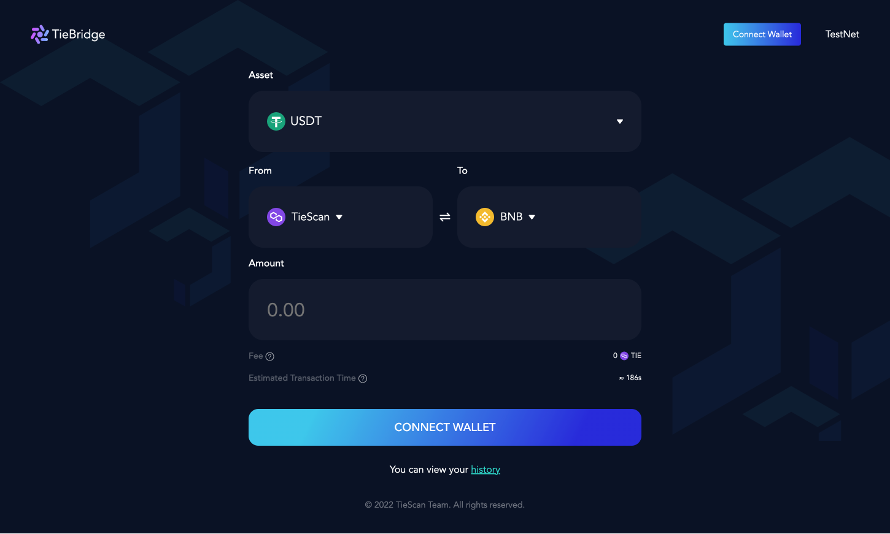
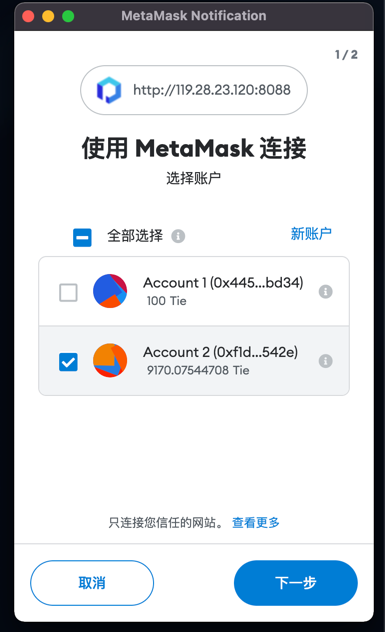
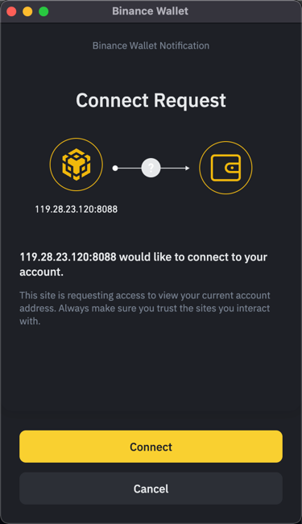
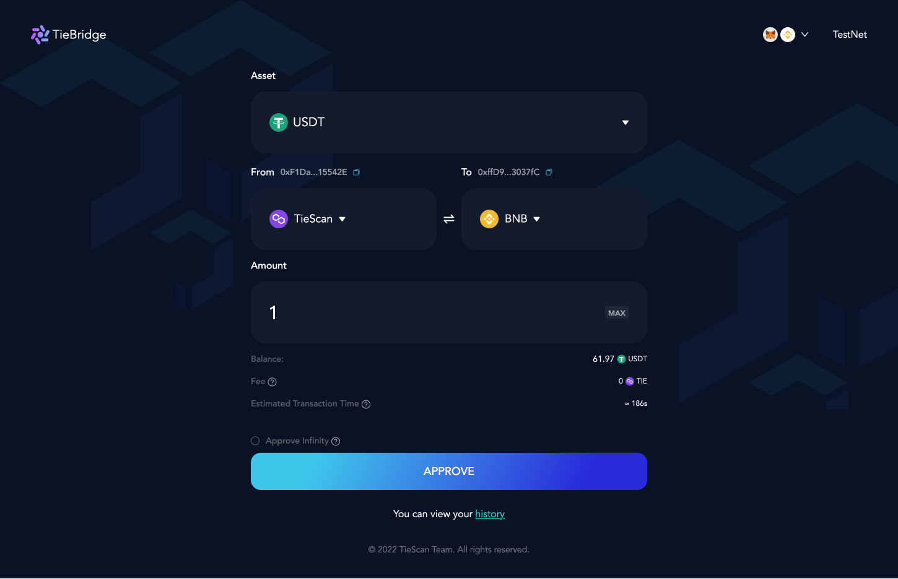
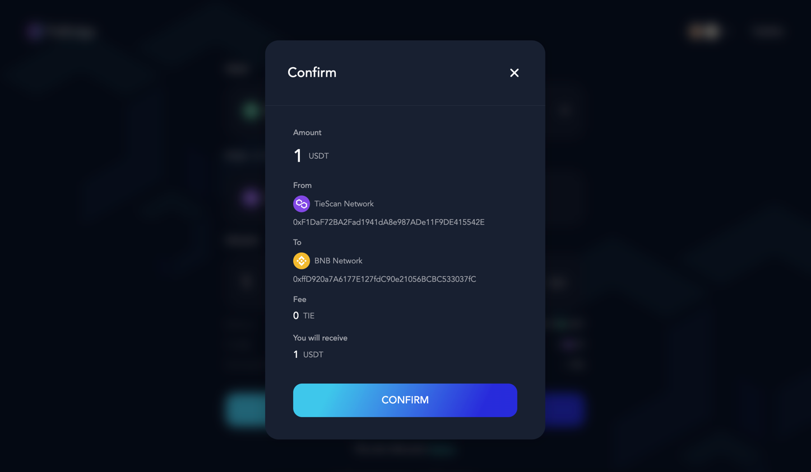
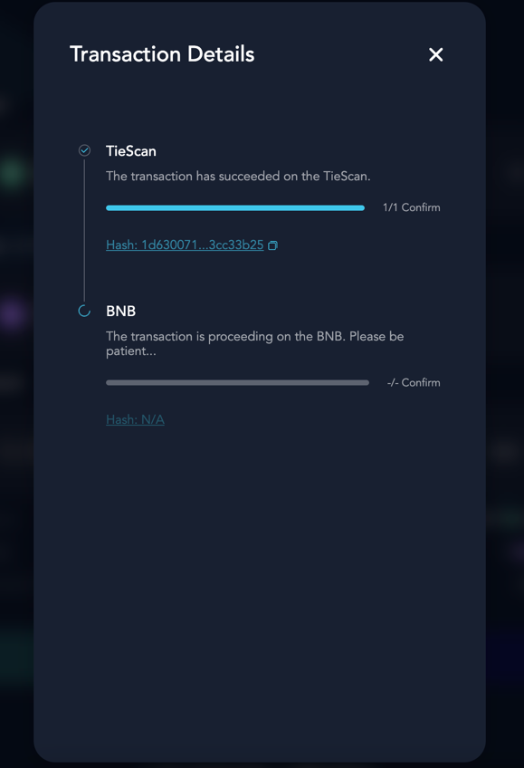
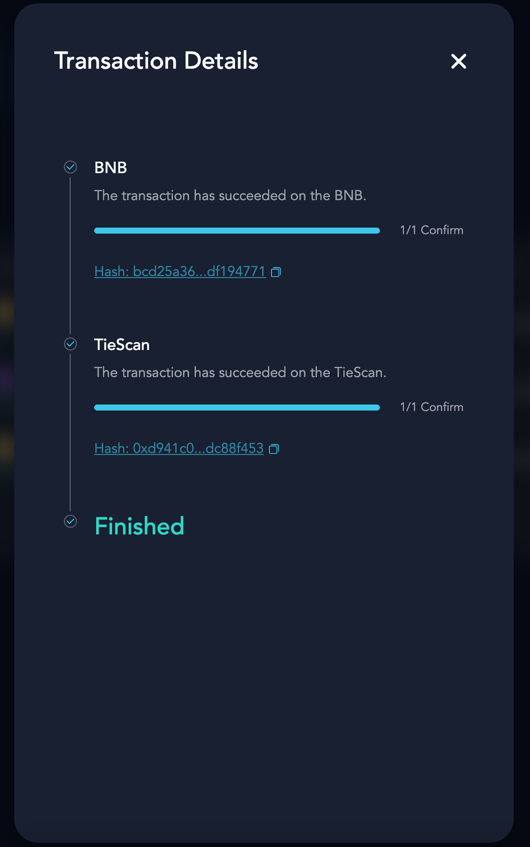
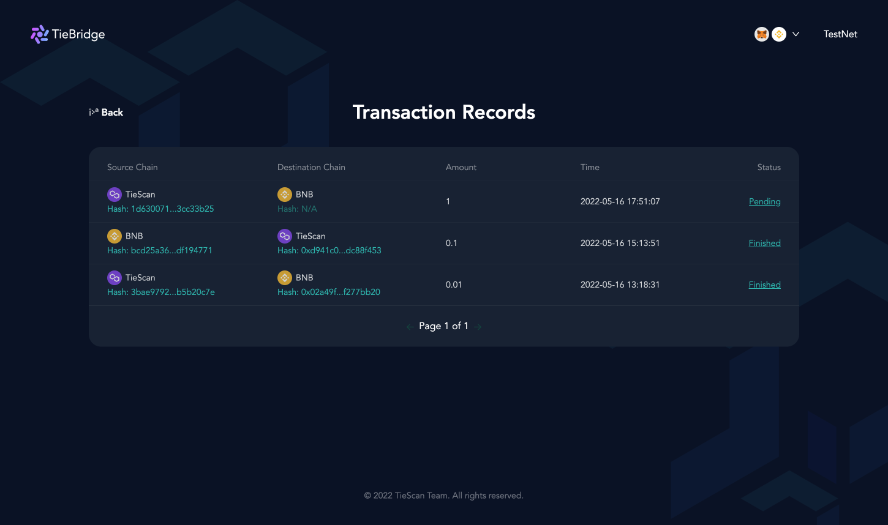
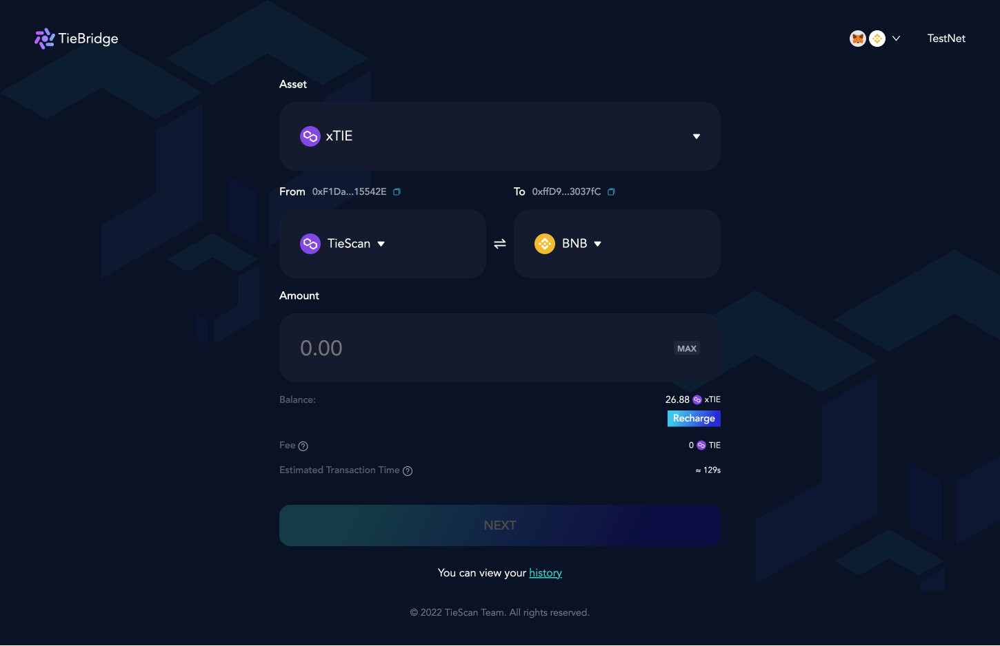

## 1. 首页

## 2. 基础功能说明
| 字段名           |    功能描述     |
|-----------------|:-----------:|
| Asset           | 选择代币(Token) |
| From            |   跨链的起始链    |
| To              |   跨链的目标链    |
| Amount          |    跨链金额     |
| Connect Wallet  |    连接钱包     |

## 3. 操作步骤

- 首先, 连接起始链的钱包, 例如: Metamask

- 然后, 连接目标链的钱包, 例如: Binance

- 填写跨链金额 并 进行钱包授权 (approve)

- 钱包允许授权

- 执行跨链转账并进行钱包确认

- 钱包确认之后, 进入等待状态
此状态大约需要 2-3 分钟的时间 (窗口是可关闭的)

- 查看交易历史
交易历史列表的状态, 可以重新查看执行状态.

- 主币转ERC20 Recharge按钮, 
消费主币, 充值ERC20代币, 只有资产TIE 且 起始链为 Tie,
才会有此充值功能.

说明: 当 TIE 跨链金额 等于 所有金额时(即全部转换), 
会存在丢失风险, 因为合约需要扣除手续费.

## 4. 附录

目前支持的链的合约地址信息

| Token | Chain |                Contract Hash                 |
|-------|------:|:--------------------------------------------:|
| USDT  |   TIE |  0xB5fabF404a12687ACe6d6f524825AC2df4B49e9E  |
| USDT  |   BSC |  0x52Ad3084a9Ad4152E52FdEAb8644a05E9Eb1E006  |
| TIE   |   TIE |  0x1418eD3036667d977394Ed86236DeA7499DB36e6  |
| TIE   |   BSC |  0x10D95320F84e96eDd3C69347Ebcf83a6B7fae0cb  |
| BNB   |   TIE |  0x2E567771D1eAb85d2a77cB832aD530e8c2C38A71  |
| BNB   |   BSC |  0xC7559ba3717BC743444E4B7d00C13160F07651a8  |