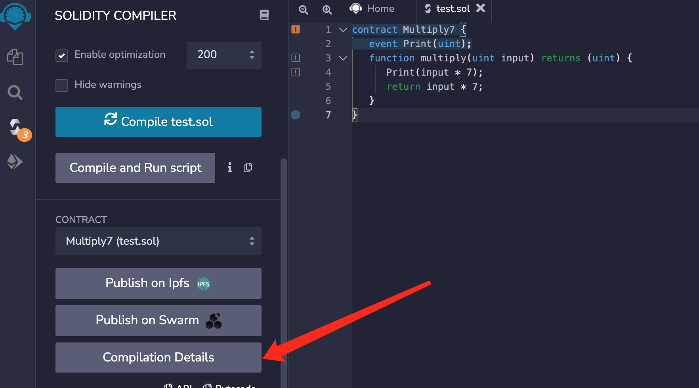
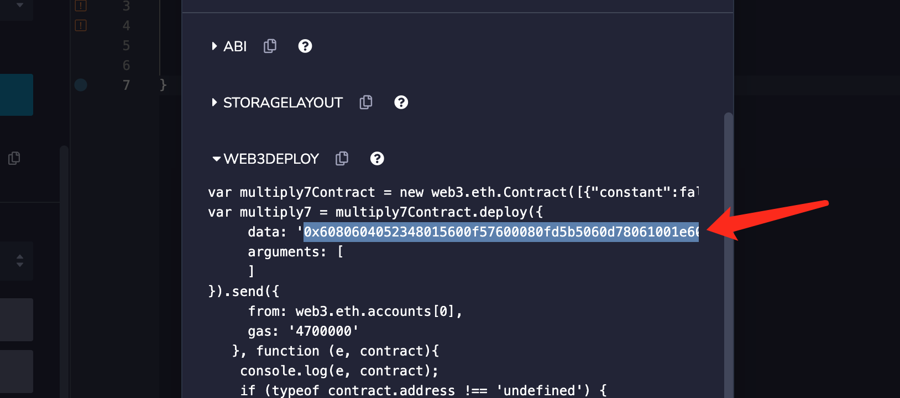
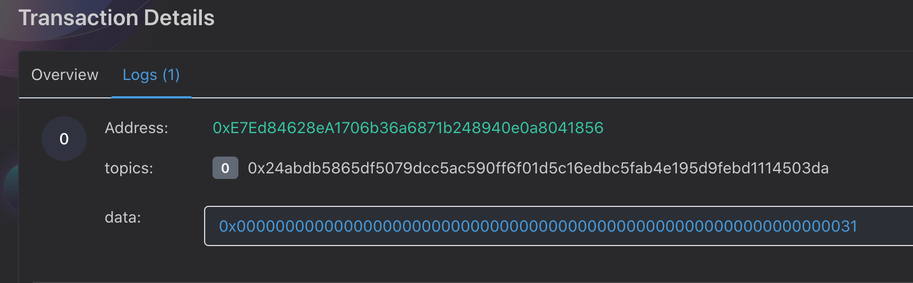

## 1. 编写合约
- 先编写一个简单的智能合约

   ```go
   contract Multiply7 {
      event Print(uint);
      function multiply(uint input) returns (uint) {
         Print(input * 7);
         return input * 7;
      }
   }
   ```

## 2. 使用 remix 编译
- 这是输入一个无符号整数做乘法的合约，接下来使用remix ide编译; **编译通过后点击"Details"，复制"WEB3DEPLOY"中的"data"数据

   

   

   ```go
   // 发送交易的源地址
   from := response.HexToAddress("0xf1c85E122Ca79F70dD7615b9038e06F4f5913611")
   input, _ := hex.ParseHexBytes("0x608060405234801561001057600080fd5b5060f58061001f6000396000f300608060405260043610603f576000357c0100000000000000000000000000000000000000000000000000000000900463ffffffff168063c6888fa1146044575b600080fd5b348015604f57600080fd5b50606c600480360381019080803590602001909291905050506082565b6040518082815260200191505060405180910390f35b60007f24abdb5865df5079dcc5ac590ff6f01d5c16edbc5fab4e195d9febd1114503da600783026040518082815260200191505060405180910390a16007820290509190505600a165627a7a72305820d36dc369a6f3f653b02c492e077b9cfdb114054f44f46277eaa4826e968609010029")
   // 构造交易对象，设置gas、gasprice、value。以wei为单位。
   // 检查源代码查看 response.Transaction 的属性类型
   txn := &response.Transaction{
           From:     from,
           Gas:      250000,
           GasPrice: 10000000000,
           Input:    input,
   }
   hexprv := "ff889c4228f47bcdbf17eca88868ec5f235dc082afa34b2a8a4e46252fee60ff" // 示例假私钥
   //nonce, _ := tie.Eth().GetNonce(txn.From, response.Latest)
   //txn.Nonce = nonce
   sign, err := tie.Eth().Sign(hexprv, txn, rpc.ChainID)
   if err != nil {
           fmt.Println(err.Error())
   }
   // 发送交易。需要检查 err，发送成功会返回 交易hash地址，使用地址在区块链浏览器查找交易
   result, err := tie.Eth().SendRawTransactionStr(sign)
   if err != nil {
           fmt.Println(err.Error())
   }
   
   fmt.Println(result)
   ```

## 3. 部署合约
- 部署合约用到Sign()和SendRawTransaction()方法, 其中from对应的是部署合约的账户地址, gas对应为gas消耗量，太少会报错. Input对应的是之前复制的data

## 4. 执行命令
- 执行命令后返回了交易hash

   ```shell
   0x9fbd58bc0163867f572d3f87abe0d10c3b9a1b6cd518f8a7085de2d9386b7934
   ```
## 5. 查询部署合约的详细信息
- 通过这个交易hash可以查询部署合约的详细信息，我们可以用GetTransactionReceipt() 方法验证一下(也可使用区块链浏览器验证交易hash是否存在)

   ```go
   buf := response.HexToHash("0x9fbd58bc0163867f572d3f87abe0d10c3b9a1b6cd518f8a7085de2d9386b7934")
   receipt, _ := tie.Eth().GetTransactionReceipt(buf)
   fmt.Println(receipt.ContractAddress)
   //获得合约的地址: 0xE7Ed84628eA1706b36a6871b248940e0a8041856
   ```

## 6. 调用合约
- 拿到合约地址后，我们可以通过Sign()和SendRawTransaction()方法调用合约

   ```go
   // 调用合约方法
   fun := "multiply(uint256)"
   bs := []byte(fun)
   b := response.Keccak256(bs)
   res := rpc.EncodeToHex(b)
   r := rpc.SubStr(res, 10)

   // 调用合约方法参数
   hash := response.HexToHash("7")
   s2 := hash.String()
   s3 := s2[2:]

   //拼接input参数
   var build strings.Builder
   build.WriteString(r)
   build.WriteString(s3)
   s4 := build.String()
   fmt.Println(s4)
   tie, err := rpc.NewClient(rpc.Url)
   if err != nil {
       fmt.Println(err.Error())
   }

   // 发送交易的源地址
   from := response.HexToAddress("0xf1c85E122Ca79F70dD7615b9038e06F4f5913611")
   to := response.HexToAddress("0xE7Ed84628eA1706b36a6871b248940e0a8041856")
   input, _ := rpc.ParseHexBytes(s4)
   
   // 构造交易对象，设置gas、gasprice、value。以wei为单位。
   // 检查源代码查看 response.Transaction 的属性类型
   txn := &response.Transaction{
           From:     from,
           To:       &to,
           Gas:      250000,
           GasPrice: 10000000000,
           Input:    input,
   }
   hexprv := "ff889c4228f47bcdbf17eca88868ec5f235dc082afa34b2a8a4e46252fee60ff" // 示例假私钥
   sign, err := tie.Eth().Sign(hexprv, txn, rpc.ChainID)
   if err != nil {
           fmt.Println(err.Error())
   }

   // 发送交易。需要检查 err，发送成功会返回 交易hash地址，使用地址在区块链浏览器查找交易
   result, err := tie.Eth().SendRawTransactionStr(sign)
   if err != nil {
           fmt.Println(err.Error())
   }
   fmt.Println(result)
   // 获得的交易hash: 0x742e610c5f393216c7d0c52b3d3c871343818f21e04f80ec19aa40deb6c88838
   ```

## 7. 在区块链浏览器查询
- 通过这个交易hash可以在浏览器中查询调用合约的详细信息

   

   我们来看一下返回数据中的logs，其中可能包含调用合约的结果。可以看log中也有data值为0x0000000000000000000000000000000000000000000000000000000000000031, 把这个十六进制转换为十进制得到数字 49. 49正好是7*7的结果，这说明我们调用合约的multiply方法成功了并得到了正确的结果